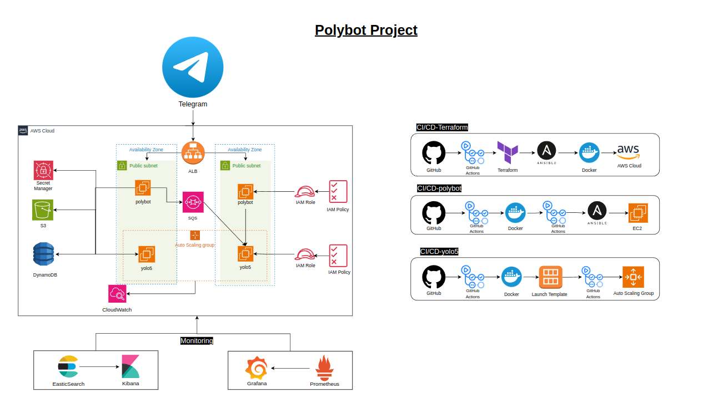
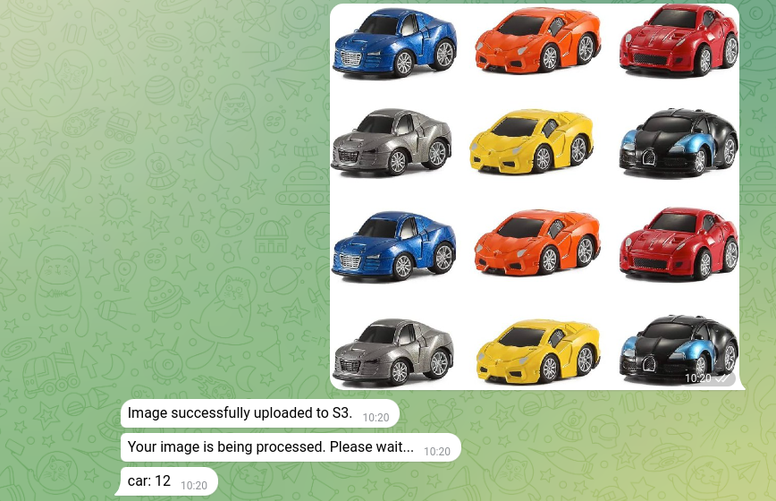
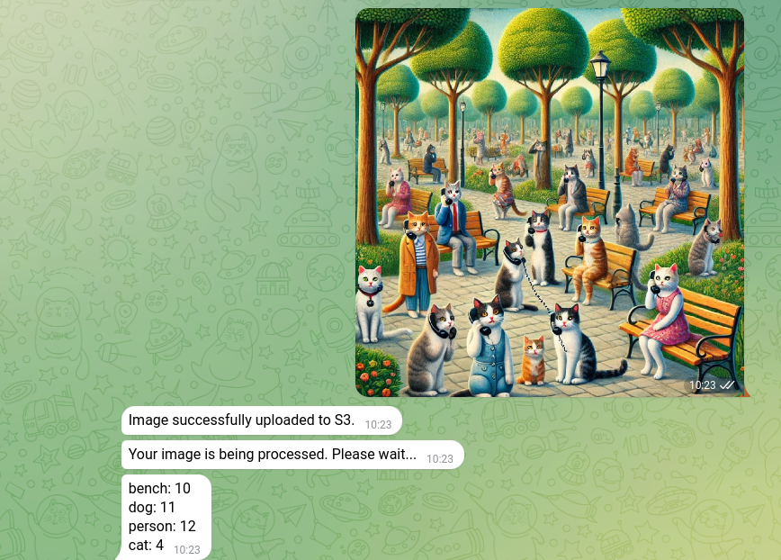
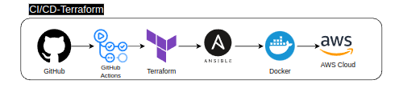
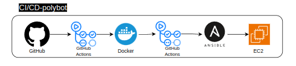

# The Polybot Project

The Polybot Project is a Telegram bot developed using Python and integrated with a REST API to leverage the YOLOv5 AI model for image and photo analysis. The primary goal of this project is to provide human-readable insights from analyzed images in a seamless and user-friendly manner.

To support its functionality, the project is deployed on AWS using an infrastructure designed with Terraform, organized into modules for clarity and maintainability. To ensure high availability, I have created the infrastructure on two different Availability Zones with two different subnets.
Both the Telegram bot and the YOLOv5 instacnes are containerized with Docker and hosted on Dockerhub for version control.

To streamline development and operations, I implemented three distinct CI/CD pipelines that automate the infrastructure setup and development workflows, creating a robust and efficient environment for continuous development.

# The Infrastructure

# Brief Overview
 
 **1. Infrastructure**
 * Terraform Modules: For clarity, scalability, and maintainability.
 * Multi-AZ Deployment: Ensures fault tolerance and high availability.
 * CI/CD Pipelines: Streamlines development and operational workflows.

 **2. Telegram Bot (Polybot) Workflow**
 * Pulls Telegram token from **AWS Secret Manager**
 * Users upload images through Telegram
 * Traffic goes to the **Application Load Balancer** and forwarded to one of the Polybot's instances using round-robin
 * The Image is being stored in an **S3 bucket** 
 * A SQS queue is being sent to the YOLOv5 instances with the image details in JSON format.

 **3. YOLOv5 Workflow** 
 * Pulls the image from the **S3 bucket** using the **SQS queue** details.
 * Analyzing the data with the YOLOv5 AI model, storing the analyzed image on s3 bucket and stores the output values in a **DynamoDB Table**
 * Scaling the **Auto Scaling Group** Based on two **CloudWatch Metrics** Alarms created for both scaling in and scaling out
 

## Application Load Balancer
The two polybot instances being grouped in the same **Target Group** that is connected to an **Application Load Balancer** , The Load Balncer is set to lsiten to **HTTPS traffic on port 8433** it's configured that way due to Telegram's requirements, after that, inside the infrastructure the ALB forwards the request to the target group to HTTP instaed on HTTPS, this prosecure makes developers life's easier as they don't need to deal with certifications and encryptions.

A Hosted Zone on **AWS Route 53** was created as well with a **CNAME RECORD** for the Load Balancer's DNS name. A certificate for the Load Balancer's new CNAME Record was created with **AWS Certificate Manager**

## The Telegram Bot (Polybot) Instances

I have deployed two instances of the Telegram bot on two different private subnets on two different Availability Zones for **High Availability and fault tolerant** architucture. The image was pulled from Dockerhub. They are not using an Autoscaling Group since most of the proccesses will happen of the YOLOv5 instances.

The **Security Group** is configured to accept traffic on **port 22 from the bastion host's ip**. An **IAM Policy** with the **least privilege principle** was created to create an **IAM Role** and attach it to the Polybot's Instances

When uploading an image to the Telegram bot it will look something like this:

    
    

## The YOLOv5 Instances

The YOLOv5 instances are deployed in two different private subnets with two different Availability Zones. They are places under an **Auto Scaling Group** that has a minimum of 2 instances and a maximum of 6, ensuring the system is available at any time. The scaling method selected is **Step Scaling**, when the average CPU utilization is 70% aross the ASG, the YOLOv5 insatnces will **scale out** and when it's 30% they will **scale in**.

he **Security Group** is configured to accept traffic **port 22 from the bastion host's ip**. An **IAM Policy** with the **least privilege principle** was created to create an **IAM Role** and attach it to the YOLOv5's Instances

## Supporting AWS Services

**AWS S3 Bucket** - 
Serves as the primary storage for user-uploaded images and processed outputs. Its durability and scalability make it ideal for storing large datasets and integrating seamlessly with other AWS services.

**AWS SQS Queue** - 
Facilitates communication between the Polybot and YOLOv5 instances by asynchronously transmitting image details in JSON format. This decoupling ensures fault tolerance and efficient processing.

**AWS DynamoDB** -
Stores analyzed image metadata and output values for fast, low-latency querying. Its serverless nature ensures minimal management and high availability.

**AWS Secrets Manager** - 
Securely manages and rotates sensitive credentials like the Telegram bot token, eliminating the need to hardcode secrets in the application.

**AWS CloudWatch** - 
Monitors system performance and triggers scaling actions for the YOLOv5 Auto Scaling Group based on predefined metrics. Ensures cost-efficient scaling while maintaining performance.

**AWS NAT Gateway** - 
Enables secure outbound internet access for instances in private subnets while keeping them inaccessible from the public internet.

**AWS Route 53**
Provides domain name management and DNS routing for the application. A CNAME record was created for the Application Load Balancer’s DNS name, enabling user-friendly access to the bot via a custom domain.

# The Pipelines, CI/CD

## Creating The Infrastructure 

As in every pipeline, it all starts with a commit and push. After that the pipeline on **Github Actions** starts. In the first job, the AWS credentials that were given using the **Github Secrets** are being set as well as the region with **Github Variables**. Then, the command `terraform init` initiates the Terraform file and maps and downloads the necessary modules for the main.tf file. `terraform apply` is running next, it uses all the variables we wrote in the tfvar.tf file, this command sets up the whole infrastructure.

In another job, **ansible** is being installed. I first created a script that takes the IPs of the polybot's instances using Terraform outputs that creates the **inventory file** for ansible. Then, the **playbook** that will install Docker, pull and run the Polybot image is being executed, it takes 5 outputs that were taken from terraform and are necessary for running the image such as the **SQS Queue's URL, DynamoDB Table's Name, Alias Record, S3 Bucket and AWS Region**

## Polybot's CI/CD

