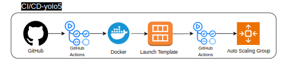

# The Polybot Project

The Polybot Project is a Telegram bot developed using Python and integrated with a REST API to leverage the YOLOv5 AI model for image and photo analysis. The primary goal of this project is to provide human-readable insights from analyzed images in a seamless and user-friendly manner.

To support its functionality, the project is deployed on AWS using an infrastructure designed with Terraform, organized into modules for clarity and maintainability. To ensure high availability, I have created the infrastructure on two different Availability Zones with two different subnets.
Both the Telegram bot and the YOLOv5 instacnes are containerized with Docker and hosted on Dockerhub for version control.

To streamline development and operations, I implemented three distinct CI/CD pipelines that automate the infrastructure setup and development workflows, creating a robust and efficient environment for continuous development.

# The Infrastructure

# Brief Overview
 
 **1. Infrastructure**
 * Terraform Modules: For clarity, scalability, and maintainability.
 * Multi-AZ Deployment: Ensures fault tolerance and high availability.
 * CI/CD Pipelines: Streamlines development and operational workflows.

 **2. Telegram Bot (Polybot) Workflow**
 * Pulls Telegram token from **AWS Secret Manager**
 * Users upload images through Telegram
 * Traffic goes to the **Application Load Balancer** and forwarded to one of the Polybot's instances using round-robin
 * The Image is being stored in an **S3 bucket** 
 * A SQS queue is being sent to the YOLOv5 instances with the image details in JSON format.

 **3. YOLOv5 Workflow** 
 * Pulls the image from the **S3 bucket** using the **SQS queue** details.
 * Analyzing the data with the YOLOv5 AI model, storing the analyzed image on s3 bucket and stores the output values in a **DynamoDB Table**
 * Scaling the **Auto Scaling Group** Based on two **CloudWatch Metrics** Alarms created for both scaling in and scaling out
 

## Application Load Balancer
The two polybot instances being grouped in the same **Target Group** that is connected to an **Application Load Balancer** , The Load Balncer is set to lsiten to **HTTPS traffic on port 8433** it's configured that way due to Telegram's requirements, after that, inside the infrastructure the ALB forwards the request to the target group to HTTP instaed on HTTPS, this prosecure makes developers life's easier as they don't need to deal with certifications and encryptions.

A Hosted Zone on **AWS Route 53** was created as well with a **CNAME Record** for the Load Balancer's DNS name. A certificate for the Load Balancer's new CNAME Record was created with **AWS Certificate Manager**

## The Telegram Bot (Polybot) Instances

I have deployed two instances of the Telegram bot on two different private subnets on two different Availability Zones for **High Availability and fault tolerance** architucture. The image was pulled from Dockerhub. They are not using an Autoscaling Group since most of the proccesses will happen of the YOLOv5 instances.

The **Security Group** is configured to accept traffic on **port 22 from the bastion host's ip**. An **IAM Policy** with the **least privilege principle** was created to create an **IAM Role** and attach it to the Polybot's Instances

When uploading an image to the Telegram bot it will look something like this:

    
    

## The YOLOv5 Instances

The YOLOv5 instances are deployed in two different private subnets with two different Availability Zones. They are places under an **Auto Scaling Group** that has a minimum of 2 instances and a maximum of 6, ensuring the system is available at any time. The scaling method selected is **Step Scaling**, when the average CPU utilization is 70% aross the ASG, the YOLOv5 insatnces will **scale out** and when it's 30% they will **scale in**.

he **Security Group** is configured to accept traffic **port 22 from the bastion host's ip**. An **IAM Policy** with the **least privilege principle** was created to create an **IAM Role** and attach it to the YOLOv5's Instances

## Supporting AWS Services

**AWS S3 Bucket** - 
Serves as the primary storage for user-uploaded images and processed outputs. Its durability and scalability make it ideal for storing large datasets and integrating seamlessly with other AWS services.

**AWS SQS Queue** - 
Facilitates communication between the Polybot and YOLOv5 instances by asynchronously transmitting image details in JSON format. This decoupling ensures fault tolerance and efficient processing.

**AWS DynamoDB** -
Stores analyzed image metadata and output values for fast, low-latency querying. Its serverless nature ensures minimal management and high availability.

**AWS Secrets Manager** - 
Securely manages and rotates sensitive credentials like the Telegram bot token, eliminating the need to hardcode secrets in the application.

**AWS CloudWatch** - 
Monitors system performance and triggers scaling actions for the YOLOv5 Auto Scaling Group based on predefined metrics. Ensures cost-efficient scaling while maintaining performance.

**AWS NAT Gateway** - 
Enables secure outbound internet access for instances in private subnets while keeping them inaccessible from the public internet.

**AWS Route 53**
Provides domain name management and DNS routing for the application. A CNAME record was created for the Application Load Balancer’s DNS name, enabling user-friendly access to the bot via a custom domain.

# The Pipelines, CI/CD

The CI/CD pipelines for the project streamline infrastructure provisioning and application deployments, ensuring consistency and automation throughout the workflow. They are structured into three key pipelines: Infrastructure Deployment, Polybot Deployment, and YOLOv5 Deployment.

##  Infrastructure Deployment

This pipeline provisions and configures the required AWS infrastructure using Terraform and Ansible for automated setup:

**First Job: Infrastructure Setup**

* Loads AWS credentials and region details securely from **GitHub Secrets**.
* Runs `terraform init` to initialize required modules and providers.
* Executes `terraform apply` to provision resources, using variables from `tfvars` files to adapt to different environments based on user preferences.

**Second Job: Configuration with Ansible**

* Extracts instance IPs and resource outputs (**SQS Queue's URL, DynamoDB Table's Name, Alias Record, S3 Bucket and AWS Region**) using Terraform outputs.
* Creates an Ansible `inventory.ini` file using a script that takes the Polybot instances IPs from Terraform. 

 Uses Ansible to:
* Install Docker on provisioned EC2 instances.
* Pull and run the Polybot Docker container image.
* Configure instances for their roles in the application, integrating with AWS services like SQS and DynamoDB.

## Polybot Deployment

This pipeline handles building and deploying the Polybot application, emphasizing consistent container management:

**Build Job:**

* Authenticates to Docker Hub using credentials stored in **GitHub Secrets**.
* **Builds, tags, and pushes** the Polybot container image to Docker Hub, ensuring version control for easier tracking and rollbacks.

**Deploy Job:**

* Identifies the Polybot instance IPs using AWS CLI filtered by tag and generates an Ansible inventory file.
* Deploys the updated Polybot container on the instances using ansible , ensuring it operates with the correct configurations and dependencies that were extracted using AWS CLI.

## YOLOv5 Deployment

The build part is almost identical to the polybot's, however the deploy is a little different. Here, in order to deploy the new changes made to the YOLOv5 image, we will need to create a new **Launch Template** for the Auto Scaling Group and it will happen it few steps using the user's credentials and AWS CLI:
1. Creating a new instance with a user-data script that runs the `docker run --restart always` command to ensure the image is running immediately when starting the instance.
2. From that instance I created a new **AMI** that will be used later as the base of my new Launch Template.
3. Terminating the instance as it is no longer needed.
4. creating a new Launch Template with the AWS CLI.
5. Attaching the new AMI to the existing Auto Scaling Group, the ASG was filtered by tag.

# Getting Started

### Secret Creation

First, we will need to create a secret on AWS Secret Manager, follow the next steps:

1. Log in to the AWS Management Console and navigate to Secrets Manager.
2. Click Store a new secret and select Other type of secret. 
3. Under Key/value pairs, enter: **Key: token , Value: < your-token-value >** 
4. In the Key Secret Name, enter `telegram-token`

Leave the rest by default.

After that, we will have to create few secrets on Github Secrets:

